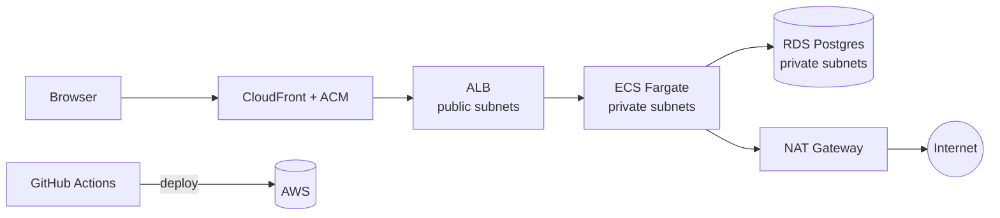

# Loan Tracker

A small internal tool that tracks which member has borrowed which piece of equipment, running on AWS.

Live at `loans.example.dev`. Built for a community workshop that was running 200 tools off a paper sign-out sheet.

---

## Architecture



Two availability zones. The load balancer sits in public subnets. The application and the
database sit in private subnets, with no inbound route from the internet.

---

## Why it's built this way

**The database is in a private subnet.**
It holds member details, so I didn't want it reachable from the internet. It sits in a
private subnet and only the application's security group can reach it on 5432.
*What that cost me:* the app then needed outbound internet access for updates, which meant
a NAT gateway, which is now most of my monthly bill.

**Fargate instead of EC2.**
The workshop has nobody to patch servers, and I didn't want to be on the hook for OS
updates on a volunteer project forever.
*What that cost me:* Fargate is roughly two to three times the compute price of an
equivalent EC2 instance. At this size that's under a pound a month, so I took the trade.

**Postgres instead of DynamoDB.**
The data is relational, and the two questions the tool exists to answer are "who has this
item right now" and "what's overdue". Both are ordinary SQL queries. I also get the
one-open-loan-per-item rule enforced by the database rather than by my own code.
*What that cost me:* an instance to patch, back up and pay for, where DynamoDB would have
had none.

**Terraform rather than the console.**
I rebuilt this environment from scratch three times while I was learning it.
*What that cost me:* slower to start. It paid for itself by the second rebuild.

---

## What it costs to run

About **£4.15/month** for around 40 active members.

| Item | Monthly |
|---|---|
| NAT Gateway | £2.90 |
| Fargate (1 task, 0.25 vCPU) | £0.85 |
| Route 53 hosted zone | £0.40 |
| RDS `db.t4g.micro` | £0.00 (free tier) |
| ALB | £0.00 (free tier) |

The NAT gateway is two thirds of the bill for a tool serving 40 people, which is the
least satisfying thing about this build.

---

## What broke

**The first deploy never came up.** ECS started a task, killed it after about two minutes,
and started another. The service log only said the task failed to stabilise.

The load balancer was health checking `/` on port 8080. The app listens on 3000, and the
task security group only allowed traffic from the load balancer on 3000. So the health
check timed out, the target was marked unhealthy, and ECS replaced a container that had
started perfectly well.

It took me about ninety minutes, because a container that crashes on startup and a
container that's killed by a failing health check look identical in the console.

Fix was to point the health check at `/healthz` on 3000, and to set the health check port
and the container port from the same Terraform variable so they can't drift apart again.

---

## What I'd do differently

- Replace the NAT gateway with VPC endpoints. Cheaper, and the app makes very few outbound calls.
- Add a `terraform plan` check to CI. Right now nothing stops a bad plan reaching apply.
- Single environment, single region. Fine for a workshop, not fine for anything with a real SLA.

---

## Running it

```bash
cp .env.example .env
docker compose up          # app on localhost:3000, with a local Postgres
```

Infrastructure lives in `infra/`. From an empty AWS account, `terraform apply` builds the
whole thing in about 12 minutes.

| Variable | Default | Notes |
|---|---|---|
| `DATABASE_URL` | — | Read from SSM when deployed; never committed. |
| `PORT` | `3000` | Must match the load balancer health check. |
| `LOAN_PERIOD_DAYS` | `14` | Loan length before an item is marked overdue. |

---

*Note on format: larger teams usually keep decisions like these in separate files called
architecture decision records. For a project this size one page is easier to read and
easier to keep current.*
